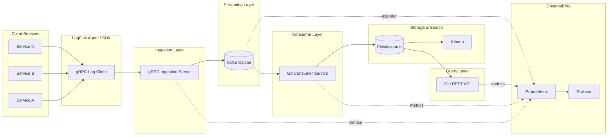
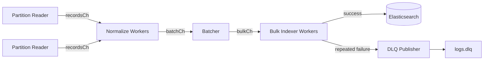

# LogFlux — Distributed Logging System

**Architecture & Implementation Plan**

Repository: `logflux`
Language: Go
Stack: Kafka • Elasticsearch/Logstash/Kibana (ELK) • gRPC • Gin • Prometheus • Grafana • Docker

---

## 1. Overview

LogFlux is a distributed logging platform that collects logs in real time from many services, streams them reliably through Kafka, indexes them in Elasticsearch, and exposes both a search/visualization layer (Kibana) and a custom REST API (Gin) for querying and integration. The system monitors its own health via Prometheus and Grafana, and ships as a fully containerized stack.

### 1.1 Goals

- Collect logs from distributed services with minimal latency, using gRPC streaming.
- Decouple producers and consumers via Kafka so that ingestion spikes don't overwhelm storage.
- Store and index logs in Elasticsearch for full-text search and filtering.
- Provide a lightweight REST API (Gin) for programmatic log queries, independent of Kibana.
- Expose internal pipeline metrics (throughput, consumer lag, error rates) via Prometheus/Grafana.
- Run the entire system locally or in CI with a single `docker-compose up`.

### 1.2 Non-Goals (v1)

- Long-term/cold storage tiering (e.g., S3 archival) — noted as a future enhancement.
- Multi-tenant access control / RBAC — single-tenant for v1.
- Distributed tracing (OpenTelemetry) — listed as a stretch goal, not core scope.
- Kubernetes manifests — v1 targets Docker Compose; Helm charts are a future enhancement.

---

## 2. High-Level Architecture



### 2.1 Data Flow Summary

1. Application services embed the **LogFlux client SDK**, which batches and streams log entries over **gRPC** to the ingestion server.
2. The **Ingestion Server** validates, enriches (adds ingest timestamp, source metadata), and publishes each log entry to a **Kafka** topic.
3. A **Go Consumer Service** subscribes to Kafka, transforms/normalizes entries, and bulk-writes them into **Elasticsearch**.
4. **Kibana** provides ad-hoc search/exploration directly on Elasticsearch; the **Gin REST API** provides a stable, application-friendly query interface (e.g., for dashboards or alerting tools that shouldn't talk to Elasticsearch directly).
5. Every component exposes a `/metrics` endpoint scraped by **Prometheus**; **Grafana** visualizes pipeline health (ingestion rate, Kafka consumer lag, ES indexing latency, error rates).

---

## 3. Component Breakdown

### 3.1 LogFlux Agent / Client SDK (Go library)

- Lightweight Go package that applications import directly (or run as a sidecar process that tails files/stdout).
- Buffers log lines locally and streams them via a **client-streaming gRPC RPC** to avoid one-request-per-line overhead.
- Handles retries and local backpressure (bounded in-memory queue with drop/oldest-first policy on overflow, configurable).
- Config: ingestion server address, TLS settings, batch size, flush interval, static labels (service name, environment).

### 3.2 Ingestion Service (gRPC server)

- Implements the `LogIngest` gRPC service (schema in §4).
- Responsibilities: authentication (token/mTLS), schema validation, enrichment (ingest timestamp, trace/request IDs if present), and publishing to Kafka.
- Stateless — can be horizontally scaled behind a load balancer; all state lives in Kafka.
- Exposes Prometheus metrics: `logs_received_total`, `logs_rejected_total`, `kafka_publish_duration_seconds`, `grpc_stream_active_connections`.

### 3.3 Kafka (streaming layer)

- Single topic `logs.raw` for v1, partitioned by `service_name` (or a hash of it) to preserve per-service ordering while allowing parallel consumption.
- Run in **KRaft mode** (no Zookeeper dependency) for a simpler container footprint.
- Retention: time-based (e.g., 24–72h) since Elasticsearch is the durable store; Kafka here is a buffer, not the system of record.
- Dead-letter topic `logs.dlq` for entries that fail consumer-side processing after retries.

### 3.4 Consumer Service (Go)

- Consumer group reading from `logs.raw`, batching records and performing Elasticsearch `_bulk` writes for throughput.
- Applies any final normalization (field renaming, log-level standardization, GeoIP/user-agent parsing if needed later).
- Tracks and exposes **consumer lag** and **bulk indexing latency/error rate** as Prometheus metrics.
- On repeated indexing failure for a batch, routes offending records to `logs.dlq` rather than blocking the partition.

#### 3.4.1 Internal Pipeline (channels + worker pools)

To index high log volume without the Kafka fetch loop stalling, the consumer is a staged pipeline connected by bounded Go channels, each stage running its own pool of goroutines:



- **Partition Readers**: one goroutine per Kafka partition assigned to this consumer instance, each writing to its own bounded `recordsCh`. Keeping a channel per partition preserves per-service ordering (topic is partitioned by `service_name`, §3.3) even though normalization and indexing happen concurrently across partitions.
- **Normalize Workers**: a fixed-size pool (configurable, e.g. `NORMALIZE_WORKERS`) fanning in from all `recordsCh`s via `select`, applying field renaming/level standardization, and pushing onto a shared `batchCh`.
- **Batcher**: accumulates records into batches by size or a flush-interval timeout, then sends complete batches on `bulkCh`. Batching here (rather than per-record) is what makes the ES `_bulk` API worthwhile at high throughput.
- **Bulk Indexer Workers**: a pool (configurable, e.g. `INDEXER_WORKERS`) reading `bulkCh` and performing `_bulk` writes in parallel; each worker retries with backoff, then routes the batch to a `dlqCh` on repeated failure so one bad batch never blocks the pipeline.
- **DLQ Publisher**: a single goroutine draining `dlqCh` and publishing to `logs.dlq`, decoupling failure handling from the indexing hot path.
- **Backpressure**: every channel is bounded (capacity is a tuning knob, not unlimited). If Elasticsearch slows down, `bulkCh`/`batchCh` fill up, which blocks `recordsCh` sends, which blocks the partition readers' `Fetch`/consume calls — surfacing as Kafka consumer lag (per §5) instead of unbounded memory growth.
- Kafka offsets are committed only after a batch is successfully indexed (or routed to DLQ), preserving at-least-once delivery per partition.

### 3.5 Storage: Elasticsearch

- Index pattern `logs-YYYY.MM.DD` (daily indices) to make retention/deletion cheap.
- Index Lifecycle Management (ILM) policy: hot for 7 days → warm for 23 days → delete after 30 days (tunable).
- Mapping defines explicit types for `timestamp`, `level`, `service`, `trace_id`, `message` (text, for full-text search), and a `fields` object for arbitrary structured key-values.

### 3.6 Visualization

- **Kibana**: connected directly to Elasticsearch for ad-hoc exploration, saved searches, and dashboards.
- **Gin REST API**: a small, purpose-built HTTP layer exposing endpoints like `GET /logs?service=&level=&from=&to=&q=` for programmatic access, so downstream tools don't need direct Elasticsearch access or query-DSL knowledge.

### 3.7 Observability of the Pipeline Itself

- Every Go service (ingestion, consumer, API) exposes `/metrics` in Prometheus format.
- **Kafka Exporter** and **Elasticsearch Exporter** (community exporters) feed broker/cluster health and index stats into Prometheus.
- **Grafana** dashboards: end-to-end ingestion rate, per-stage latency, Kafka consumer lag, ES cluster health, error rates, container resource usage.

### 3.8 Deployment

- `docker-compose.yml` defines all services: agent(s)/demo log generator, ingestion server, Kafka (KRaft), Elasticsearch, Kibana, consumer service, Gin API, Prometheus, Grafana.
- Each Go service has its own `Dockerfile` (multi-stage build: `golang:alpine` builder → distroless/`scratch` runtime image).
- `.env` file for shared configuration (ports, credentials, retention settings).

---

## 4. Data Model & API Design

### 4.1 Log Entry Schema (protobuf)

```protobuf
syntax = "proto3";
package logflux.v1;

message LogEntry {
  string service_name   = 1;
  string environment     = 2;
  int64  timestamp_unix_ms = 3;
  Level  level           = 4;
  string message         = 5;
  string trace_id        = 6;
  map<string, string> fields = 7; // arbitrary structured metadata
}

enum Level {
  LEVEL_UNSPECIFIED = 0;
  DEBUG = 1;
  INFO  = 2;
  WARN  = 3;
  ERROR = 4;
  FATAL = 5;
}

service LogIngest {
  // Client-streaming: agent pushes a continuous stream of entries.
  rpc StreamLogs(stream LogEntry) returns (StreamAck);
}

message StreamAck {
  int64 accepted_count = 1;
  int64 rejected_count = 2;
}
```

### 4.2 REST API (Gin)

| Method | Endpoint          | Description                                      |
|--------|-------------------|---------------------------------------------------|
| GET    | `/logs`           | Query logs (`service`, `level`, `from`, `to`, `q`) |
| GET    | `/logs/:id`       | Fetch a single log entry by Elasticsearch doc ID   |
| GET    | `/services`       | List known service names (for dashboard filters)   |
| GET    | `/healthz`        | Liveness check                                     |
| GET    | `/metrics`        | Prometheus scrape endpoint                         |

---

## 5. Scalability & Reliability Considerations

- **Horizontal scaling**: ingestion servers and consumer instances are stateless and scale independently; Kafka partition count bounds consumer parallelism, so choose partition count with expected peak load in mind. Within a single consumer instance, the normalize-worker and bulk-indexer pool sizes (§3.4.1) are additional parallelism knobs for scaling up throughput on a fixed partition count.
- **Backpressure**: if Elasticsearch slows down, the consumer's bounded internal channels (§3.4.1) fill up and stall partition reads, which stalls Kafka fetch — Kafka absorbs the burst; consumer lag becomes the visible signal (surfaced in Grafana) rather than data loss or unbounded memory growth.
- **At-least-once delivery**: acceptable for logs; consumer writes should be idempotent where feasible (e.g., deterministic document IDs from trace_id + timestamp) to reduce duplicate risk on retries.
- **Failure isolation**: a malformed batch goes to `logs.dlq` instead of blocking the partition.

## 6. Security Considerations

- TLS on the gRPC ingestion endpoint; mTLS or token-based auth for agents.
- Kafka inter-broker and client traffic secured with TLS/SASL in any non-local deployment.
- Elasticsearch/Kibana behind authentication (even basic security features are sufficient for v1).
- No secrets committed to the repo — all credentials via `.env`/Docker secrets.

---

## 7. Repository Structure

```
logflux/
├── cmd/
│   ├── ingestion/        # gRPC ingestion server entrypoint
│   ├── consumer/         # Kafka -> Elasticsearch consumer entrypoint
│   ├── api/               # Gin REST API entrypoint
│   └── agent/             # example/demo log-generating client
├── internal/
│   ├── ingestion/         # gRPC handlers, validation, enrichment
│   ├── consumer/          # Kafka consumer logic, ES bulk writer
│   ├── api/                # Gin routes/handlers
│   ├── kafka/              # shared Kafka client wrappers
│   ├── esclient/           # shared Elasticsearch client wrappers
│   └── metrics/            # shared Prometheus instrumentation helpers
├── proto/
│   └── logflux/v1/log.proto
├── deploy/
│   ├── docker-compose.yml
│   ├── prometheus/prometheus.yml
│   ├── grafana/dashboards/
│   └── elasticsearch/ilm-policy.json
├── Dockerfile.ingestion
├── Dockerfile.consumer
├── Dockerfile.api
├── go.mod
└── README.md
```

---

## 8. Implementation Plan (Phased)

### Phase 0 — Project Setup
- Initialize Go module, repo structure, linting/formatting (`golangci-lint`), CI skeleton.
- Write `.proto` schema and generate Go stubs.

### Phase 1 — Ingestion Path
- Implement gRPC `LogIngest` server with in-memory/log-only sink (no Kafka yet) to validate the streaming contract.
- Implement the client SDK/agent with batching + retry logic.
- Add unit tests for validation and batching behavior.

### Phase 2 — Kafka Integration
- Stand up Kafka (KRaft) via Docker Compose.
- Wire ingestion server to publish to `logs.raw`.
- Add producer-side metrics and basic integration test (produce → assert message on topic).

### Phase 3 — Consumer & Storage
- Implement consumer service: consume from Kafka, batch, bulk-write to Elasticsearch.
- Define index mapping and ILM policy; provision via startup script.
- Implement DLQ routing for failed batches.

### Phase 4 — Query & Visualization
- Build Gin REST API endpoints (`/logs`, `/logs/:id`, `/services`).
- Configure Kibana index patterns and a couple of default saved searches/dashboards.

### Phase 5 — Observability
- Instrument all Go services with Prometheus metrics.
- Add Kafka and Elasticsearch exporters.
- Build Grafana dashboards (ingestion overview, consumer lag, cluster health).

### Phase 6 — Containerization & Polish
- Write multi-stage Dockerfiles for each Go service.
- Finalize `docker-compose.yml` wiring all components together with healthchecks.
- Write README with architecture diagram, quick-start instructions, and demo script (spin up stack, run demo agent, view logs in Kibana + Grafana).

### Phase 7 — Stretch Goals (optional, post-v1)
- OpenTelemetry tracing across ingestion → consumer → storage.
- Kubernetes/Helm deployment option.
- Cold-storage tiering (S3) via ILM.
- Alerting rules (Prometheus Alertmanager) for lag/error thresholds.

---

## 9. Tech Stack Summary

| Layer            | Technology              | Purpose                                      |
|-------------------|--------------------------|-----------------------------------------------|
| Collection         | Go + gRPC                | Real-time, low-overhead log ingestion          |
| Streaming          | Kafka (KRaft)             | Durable buffering, decoupling, replay          |
| Processing         | Go (consumer service)    | Transform + bulk-load into storage             |
| Storage/Search     | Elasticsearch            | Indexing and full-text search                  |
| Visualization      | Kibana + Gin (REST API)  | Ad-hoc exploration + programmatic queries      |
| Monitoring         | Prometheus + Grafana     | Pipeline health and system observability       |
| Deployment         | Docker / Docker Compose  | Reproducible, containerized environment        |

