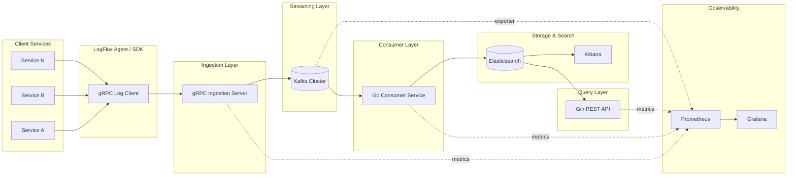

# LogFlux

A distributed logging platform: services stream logs over gRPC to an ingestion
server, which publishes them to Kafka; a consumer service bulk-indexes them
into Elasticsearch; Kibana and a Gin REST API expose them for search; the
whole pipeline's health is visible in Grafana. See [ARCHITECTURE.md](ARCHITECTURE.md)
for the full design.

## Architecture



## Quick start

Requires Docker and Docker Compose v2.20+ (for the `include:` support used to
combine `docker-compose-infra.yml` and `docker-compose.yml`).

```bash
docker compose up -d
```

This builds and starts everything: Elasticsearch, Kibana, a 2-node Kafka
(KRaft) cluster, the Kafka/Elasticsearch Prometheus exporters, Prometheus,
Grafana, and the four LogFlux Go services (`ingestion`, `consumer`, `api`,
`agent`). One-shot provisioning containers (`es-setup`, `kafka-topics-init`,
`kibana-setup`) set up ES index templates/ILM, Kafka topics, and Kibana saved
objects before the app services start.

Wait for everything to report healthy:

```bash
docker compose ps
```

Once `ingestion`, `consumer`, and `api` show `(healthy)`, the stack is ready.

### Where to look

| What | URL | Notes |
|---|---|---|
| REST API | http://localhost:8081 | `/logs`, `/logs/:id`, `/services`, `/healthz`, `/metrics` |
| Kibana | http://localhost:5601 | login `elastic` / `$ELASTIC_PASSWORD` (see `.env`) |
| Grafana | http://localhost:3000 | login `admin` / `$GRAFANA_ADMIN_PASSWORD` (see `.env`); dashboards under the "LogFlux" folder |
| Prometheus | http://localhost:9090 | raw metrics/targets |
| Kafka UI | http://localhost:8080 | inspect `logs.raw`/`logs.dlq` topics, partitions, consumer group lag |
| Ingestion gRPC | localhost:9000 | `LogIngest.StreamLogs` |

## Demo script

The `agent` service is already running as part of `docker compose up`,
continuously streaming synthetic log lines through the whole pipeline. To
watch it end-to-end:

1. **Confirm logs are flowing through the REST API:**
   ```bash
   curl "http://localhost:8081/logs?service=demo-agent&size=5"
   curl "http://localhost:8081/services"
   ```

2. **View them in Kibana:** open http://localhost:5601, go to
   **Dashboards → LogFlux Overview** (provisioned automatically), or
   **Discover** with the `logs-*` index pattern. Filter by
   `service: demo-agent`.

3. **Watch pipeline health in Grafana:** open http://localhost:3000 and the
   "LogFlux" folder has three dashboards:
   - **Ingestion Overview** — logs received/rejected rate, active gRPC
     streams, Kafka publish latency.
   - **Consumer Lag** — Kafka consumer lag, indexing rate, bulk-index
     errors/latency.
   - **Cluster Health** — Kafka broker count, Elasticsearch cluster status.

4. **Follow the raw pipeline yourself:**
   ```bash
   docker compose logs -f ingestion consumer
   ```

5. **Tear down when done:**
   ```bash
   docker compose down          # stop and remove containers
   docker compose down -v       # also delete all data volumes
   ```

## Local development (without full containerization)

Each service also runs directly on the host against the infra stack alone —
useful for iterating on Go code without rebuilding images each time:

```bash
docker compose -f docker-compose-infra.yml up -d
go run ./cmd/ingestion   # KAFKA_BROKERS defaults to localhost:9094,localhost:9095
go run ./cmd/consumer    # same, plus ELASTICSEARCH_URL default of localhost:9200
go run ./cmd/api         # ELASTICSEARCH_URL default of localhost:9200, listens on :8081
go run ./cmd/agent       # INGESTION_ADDR defaults to localhost:9000
```

## Repository layout

See [ARCHITECTURE.md §7](ARCHITECTURE.md#7-repository-structure) for the full
breakdown of `cmd/`, `internal/`, `proto/`, and `infra/`.

Dependencies are vendored (`vendor/`) so container builds don't depend on
`proxy.golang.org` being reachable at build time; run `go mod vendor` after
changing `go.mod`/`go.sum`.
